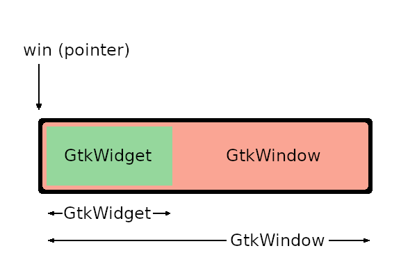
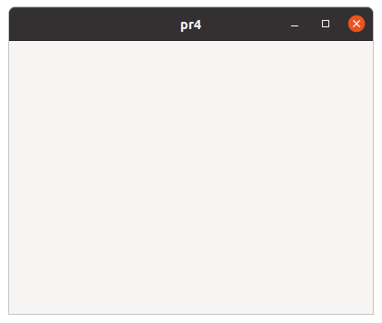

Up: [Readme.md](../Readme.md),  Prev: [Section 2](sec2.md), Next: [Section 4](sec4.md)

# GtkApplication and GtkApplicationWindow

## GtkApplication

### GtkApplication and g\_application\_run

Usually people write a programming code to make an application.
What are appications?
Applications are software that runs using libraries, which includes OS, frameworks and so on.
In Gtk4 programming, GtkApplication is an object that runs on GTK libraries.

The basic way how to write GtkApplication is as follows.

- Generate a GtkApplication object
- Run it

That's all.
Very simple.
The following is the C code representing the scenario above.

     1 #include <gtk/gtk.h>
     2 
     3 int
     4 main (int argc, char **argv) {
     5   GtkApplication *app;
     6   int stat;
     7 
     8   app = gtk_application_new ("com.github.ToshioCP.pr1", G_APPLICATION_FLAGS_NONE);
     9   stat =g_application_run (G_APPLICATION (app), argc, argv);
    10   g_object_unref (app);
    11   return stat;
    12 }
    13 

The first line says that this program includes the header files of the Gtk libraries.
The function `main` above is a startup function in C language.
The variable `app` is defined as a pointer to GtkApplication, which is actually a structure in which information about the application is stored.
The function `gtk_application_new` generates a GtkApplication object and sets its pointer to `app`.
The meaning of the arguments will be explained later.
The function `g_application_run` invokes the GtkApplication object pointed by `app`.
(We often say that the function invokes `app`.
Actually, `app` is not an object but an pointer to the object.
However, it is simple and short, and probably no confusion occurs.)

To compile this, the following command needs to be run.
The string pr1.c is the filename of the C source code above.

    $ gcc `pkg-config --cflags gtk4` pr1.c `pkg-config --libs gtk4`

The C compiler gcc generates an executable file `a.out`.
Let's run it.

    $ ./a.out

    (a.out:13533): GLib-GIO-WARNING **: 15:30:17.449: Your application does not implement g_application_activate() and has no handlers connected to the "activate" signal.  It should do one of these.
    $ 

Oh, just an error message.
But this error message means that the GtkApplication object ran without a doubt.
Now, think about the message in the next subsection.

### signal

The message tells us that:

1. The application GtkApplication doesn't implement `g_application_activate()`.
2. And it has no handlers connected to the activate signal.
3. You need to solve at least one of these.

These two causes of the error are related to signals.
So, I will explain it to you first.

Signal is emitted when something happens.
For example, a window is generated, a window is destroyed and so on.
The signal "activate" is emitted when the application is activated.
If the signal is connected to a function, which is called signal handler or simply handler, then the function is invoked when the signal emits.
The flow is like this:

1. Something happens.
2. If it's related to a certain signal, then the signal is emitted.
3. If the signal is connected to a handler in advance, then the handler is invoked.

Signals are defined in objects.
For example, "activate" signal belongs to GApplication object, which is a parent object of GtkApplication object.
GApplication object is a child object of GObject object.
GObject is the top object in the hierarchy of all the objects.

    GObject -- GApplication -- GtkApplication
    <---parent                      --->child

A child object inherits signals, functions, properties and so on from its parent object.
So, Gtkapplication also has the "activate" signal.

Now we can solve the problem in `pr1.c`.
We need to connect the activate signal to a handler.
We use a function `g_signal_connect` which connects a signal to a handler.

     1 #include <gtk/gtk.h>
     2 
     3 static void
     4 on_activate (GApplication *app, gpointer *user_data) {
     5   g_print ("GtkApplication is activated.\n");
     6 }
     7 
     8 int
     9 main (int argc, char **argv) {
    10   GtkApplication *app;
    11   int stat;
    12 
    13   app = gtk_application_new ("com.github.ToshioCP.pr2", G_APPLICATION_FLAGS_NONE);
    14   g_signal_connect (app, "activate", G_CALLBACK (on_activate), NULL);
    15   stat =g_application_run (G_APPLICATION (app), argc, argv);
    16   g_object_unref (app);
    17   return stat;
    18 }
    19 

First, we define the handler `on_activate` which simply displays a message.
In the function `main`, we add `g_signal_connect` before `g_application_run`.
The function `g_signal_connect` has four arguments.

1. An object to which the signal belongs.
2. The name of the signal.
3. A handler function (also called callback), which needs to be casted by `G_CALLBACK`.
4. Data to pass to the handler. If no data is necessary, NULL should be given.

You can find the description of each signal in API reference.
For example, "activate" signal is in GApplication section in GIO API reference.
The handler function is described in that section.

In addition, `g_signal_connect` is described in GObject API reference.
API reference is very important.
You should see and understand it to write GTK applications.
They are located in ['GNOME Developer Center'](https://developer.gnome.org/).

Let's compile the source file above (`pr2.c`) and run it.

    $ gcc `pkg-config --cflags gtk4` pr2.c `pkg-config --libs gtk4`
    $ ./a.out
    GtkApplication is activated.
    $ 

OK, well done.
However, you may have noticed that it's painful to type such a long line to compile.
It is a good idea to use shell script to solve this problem.
Make a text file which contains the following line. 

    gcc `pkg-config --cflags gtk4` $1.c `pkg-config --libs gtk4`

Then, save it under the directory $HOME/bin, which is usually /home/(username)/bin.
(If your user name is James, then the directory is /home/james/bin).
And turn on the execute bit of the file.
Suppose the filename is `comp`, then the procedure is as follows.

    $ chmod 755 $HOME/bin/comp
    $ ls -log $HOME/bin
        ...  ...  ...
    -rwxr-xr-x 1   62 May 23 08:21 comp
        ...  ...  ...

If this is the first time that you make a $HOME/bin directory and save a file in it, then you need to logout and login again.

    $ comp pr2
    $ ./a.out
    GtkApplication is activated.
    $ 

## GtkWindow and GtkApplicationWindow

### GtkWindow

A message "GtkApplication is activated." was printed out in the previous subsection.
It was good in terms of a test of GtkApplication.
However, it is insufficient because GTK is a framework for graphical user interface (GUI).
Now we go ahead with adding a window into this program.
What we need to do is:

1. Generate a GtkWindow.
2. Connect it to GtkApplication.
3. Show the window.

Now rewrite the function `on_activate`.

#### Generate a GtkWindow

    1 static void
    2 on_activate (GApplication *app, gpointer user_data) {
    3   GtkWidget *win;
    4 
    5   win = gtk_window_new ();
    6   gtk_window_set_application (GTK_WINDOW (win), GTK_APPLICATION (app));
    7   gtk_widget_show (win);
    8 }

Widget is an abstract concept that includes all the GUI interfaces such as windows, dialogs, buttons, multiline text, containers and so on.
And GtkWidget is a base object from which all the GUI objects derive.

    parent <-----> child
    GtkWidget -- GtkWindow

GtkWindow includes GtkWidget at the top of its object.

The function `gtk_window_new` is defined as follows.

    GtkWidget *
    gtk_window_new (void);

By this definition, it returns a pointer to GtkWidget, not GtkWindow.
It actually generates a new GtkWindow object (not GtkWidget) but returns a pointer to GtkWidget.
However,the pointer points the GtkWidget and at the same time it also points GtkWindow that contains GtkWidget in it.

If you want to use `win` as a pointer to the GtkWindow, you need to cast it.

    (GtkWindow *) win

Or you can use `GTK_WINDOW` macro that performs a similar function.

    GTK_WINDOW (win)

This is a recommended way.

#### Connect it to GtkApplication.

The function `gtk_window_set_application` is used to connect GtkWidow to GtkApplication.

      gtk_window_set_application (GTK_WINDOW (win), GTK_APPLICATION (app));

You need to cast `win` to GtkWindow and `app` to GtkApplication.
`GTK_WINDOW` and `GTK_APPLICATION` macro is appropriate for that.

GtkApplication continues to run until the related window is destroyed.
If you didn't connect GtkWindow and GtkApplication, GtkApplication shutdowns immediately.
Because no window is connected to GtkApplication, it doesn't need to wait anything.
As it shutdowns the generated window is also destroyed.

#### Show the window.

The function `gtk_widget_show` is used to show the window.

Gtk4 changed the default widget visibility to on, so every widget doesn't need this function to show itself.
But, there's an exception.
Top window (this term will be explained later) isn't visible when it is generated.
So you need to use the function above and show the window.

Save the program as `pr3.c` and compile and run it.

    $ comp pr3
    $ ./a.out

A small window appears.

Click on the close button then the window disappears and the program finishes.

### GtkApplicationWindow

GtkApplicationWindow is a child object of GtkWindow.
It has some extra functionality for better integration with GtkApplication.
It is recommended to use it instead of GtkWindow when you use GtkApplication.

Now rewrite the program and use GtkAppliction Window.

    1 static void
    2 on_activate (GApplication *app, gpointer user_data) {
    3   GtkWidget *win;
    4 
    5   win = gtk_application_window_new (GTK_APPLICATION (app));
    6   gtk_window_set_title (GTK_WINDOW (win), "pr4");
    7   gtk_window_set_default_size (GTK_WINDOW (win), 400, 300);
    8   gtk_widget_show (win);
    9 }

When you generate GtkApplicationWindow, you need to give GtkApplication object as an argument.
Then it automatically connect these two objects.
So you don't need to call `gtk_window_set_application` any more.

The program sets the title and the default size of the window.
Compile it and run `a.out`, then you will see a bigger window with its title "pr4".

Up: [Readme.md](../Readme.md),  Prev: [Section 2](sec2.md), Next: [Section 4](sec4.md)
