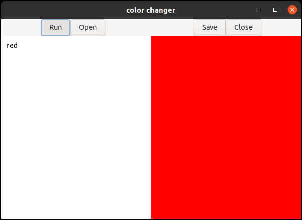

# Combine GtkDrawingArea and TfeTextView

Now, we will make a new application which has GtkDrawingArea and TfeTextView in it.
Its name is "color".
If you write a color in TfeTextView and click on the `run` button, then the color of GtkDrawingArea changes to the color given by you.

The following colors are available.

- white
- black
- red
- green
- blue

In addition the following two options are also available.

- light: Make the color of the drawing area lighter.
- dark: Make the color of the drawing area darker.

This application can only do very simple things.
However, it tells us that if we add powerful parser to it, we will be able to make it more efficient.
I want to show it to you in the later section by making a turtle graphics language like Logo program language.

In this section, we focus on how to bind the two objects.

# Color.ui and color.gresource.xml

First, We need to make the ui file of the widgets.
The image in the previous subsection gives us the structure of the widgets.
Title bar, four buttons in the tool bar and two widgets textview and drawing area.
The ui file is as follows.

@@@ color/color.ui

- 9-53: This part describes the tool bar which has four buttons, `Run`, `Open`, `Save` and `Close`.
This is similar to the toolbar of tfe text editor in [Section 8](sec8.src.md).
There are two differences.
`Run` button replaces `New` button.
Signal element are added to each button object.
It has "name" attribute which is a signal name and "handler" attribute which is the name of its signal handler function.
Options "-WI, --export-dynamic" CFLAG is necessary when you compile the application.
You can achieve this by adding "export_dynamic: true" argument to executable function in `meson.build`.
And be careful that the handler must be defined without 'static' class.
- 54-76: Put GtkScrolledWindow and GtkDrawingArea into GtkBox.
GtkBox has "homogeneous property with TRUE value, so the two children have the same width in the box.
TfeTextView is a child of GtkScrolledWindow.

The xml file for the resource compiler is almost same as before.
Just substitute "color" for "tfe".

@@@ color/color.gresource.xml

# Tfetextview.h, tfetextview.c and color.h

First two files are almost same as before.
The only difference is the header file in tfettextview.c.

$$$
diff tfe5/tfetextview.c color/tfetextview.c
$$$

Color.h just includes tfetextview.h.

@@@ color/color.h

# Colorapplication.c

This is the main file.
It deals with:

- Build widgets by GtkBuilder.
- Set drawing function to GtkDrawingArea.
And connect a handler to "resize" signal on GtkDrawingArea.
- Implement each call back functions.
Particularly, `Run` signal handler is the point in this program.

The following is `colorapplication.c`.

@@@ color/colorapplication.c

- 108-121: The function `main` is almost same as before but there are some differences.
The application ID is "com.github.ToshioCP.color".
`G_APPLICATION_FLAGS_NONE` is specified so no open signal handler is necessary.
- 86-106: Startup handler.
- 91-96: Build widgets.
The pointers of the top window, TfeTextView and GtkDrawingArea objects are stored to static variables `win`, `tv` and `da` respectively.
This is because these objects are often used in handlers.
They never be rewritten so they're thread safe.
- 97: connect "resize" signal and the handler.
- 98: set the drawing function.
- 81-84: Activate handler, which just show the widgets.
- 73-79: The drawing function.
It just copy `surface` to destination.
- 65-71: Resize handler.
Re-create the surface to fit the width and height of the drawing area and paint by calling the function `run`.
- 58-63: Close handler.
It destroys `surface` if it exists.
Then it destroys the top window and quits the application.
- 48-56: Open and save handler.
They just call the corresponding functions of TfeTextView.
- 42-46: Run handler.
It calls run function to paint the surface.
After that `gtk_widget_queue_draw` is called.
This fhunction adds the widget (GtkDrawingArea) to the queue to be redrawn.
It is important to know that the drawing function is called when it is necessary.
For example, when another window is moved and uncovers part of the widget, or when the window containing it is resized.
But repaint of `surface` is not automatically notified to gtk.
Therefore, you need to call `gtk_widget_queue_draw` to redraw the widget.
- 9-40: Run function paint the surface.
First, it gets the contents of GtkTextBuffer.
Then compare it to "red", "green" and so on.
If it matches the color, then the surface is painted the color.
If it matches "light" or "dark", then the color of the surface is lightened or darkened respectively.
Alpha channel is used.

# Meson.build

This file is almost same as before.
An argument "export_dynamic: true" is added to executable function.

@@@ color/meson.build

# Compile and execute it

First you need to export some variables (refer to [Section 2](sec2.src.md)).

    $ . env.sh

Then type the following to compile it.

    $ meson _build
    $ ninja -C _build

The application is made in `_build` directory.
Type the following to execute it.

    $ _build/color

Type "red", "green", "blue", "white", black", "light" or "dark" in the TfeTextView.
Then, click on `Run` button.
Make sure the color of GtkDrawingArea changes.

In this program TfeTextView is used to change the color.
You can use buttons or menus instead of textview.
Probably it is more appropriate.
Using textview is unnatural.
It is a good practice to make such application by yourself.
