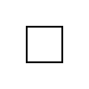

# GtkDrawingArea and Cairo

If you want to draw dynamically, like an image window of gimp graphics editor, GtkDrawingArea widget is the most suitable widget.
You can draw or redraw an image in this widget freely.
It is called custom drawing.

GtkDrawingArea provides a cairo context so users can draw images by cairo functions.
In this section, I will explain:

1. Cairo, but briefly.
2. GtkDrawingArea with very simple example.

## Cairo

Cairo is a two dimensional graphics library.
First, you need to know surface, source, mask, destination, cairo context and transformation.

- Surface represents an image.
It is like a canvas.
We can draw shapes and images with different colors on surfaces.
- Source pattern, or simply source, is a kind of paint, which will be transferred to destination surface by cairo functions.
- Mask is image mask used in the transference.
- Destination is a target surface.
- Cairo context manages the transference from source to destination through mask with its functions.
For example, `cairo_stroke` is a function to draw a path to the destination by the transference.
- Transformation is applied before the transfer completes.
The transformation is called affine, which is a mathematics terminology, and represented by matrix multiplication and vector addition.
Scaling, rotation, reflection, shearing and translation are examples of affine transformation.
In this section, we don't use it.
That means we only use identity transformation.
Therefore, the coordinate in source and mask is the same as the coordinate in destination.

{width=9.0cm height=6.0cm}

The instruction is as follows:

1. Create a surface.
This will be a destination.
2. Create a cairo context with the surface and the surface will be the destination of the context.
3. Create a source pattern within the context.
4. Create paths, which are lines, rectangles, arcs, texts or more complicated shapes, to generate a mask.
5. Use drawing operator such as `cairo_stroke` to transfer the paint in the source to the destination.
6. Save the destination surface to a file if necessary.

Here's a simple example code that draws a small square and save it as a png file.

@@@include
misc/cairo.c
@@@

- 1: Includes the header file of cairo.
- 12: `cairo_image_surface_create` creates an image surface.
`CAIRO_FORMAT_RGB24` is a constant which means that each pixel has red, green and blue data.
Each data has 8 bit quantity.
Modern displays have this type of color depth.
Width and height are pixels and given as integers.
- 13: Creates cairo context.
The surface given as an argument will be the destination of the context.
- 17: `cairo_set_source_rgb` creates a source pattern, which is a solid white paint.
The second to fourth argument is red, green and blue color depth respectively.
Their type is float and the values are between zero and one.
(0,0,0) is black and (1,1,1) is white.
- 18: `cairo_paint` copies everywhere in the source to destination.
The destination is filled with white pixels by this command.
- 20: Sets the source color to black.
- 21: `cairo_set_line_width` set the width of lines.
In this case, the line width is set to two pixels.
(It is because the transformation is identity.
If the transformation isn't identity, for example scaling with the factor three, the actual width in destination will be six (2x3=6) pixels.)
- 22: Draws a rectangle (square).
The top-left coordinate is (width/2.0-20.0, height/2.0-20.0) and the width and height have the same length 40.0.
- 23: `cairo_stroke` transfer the source to destination through the rectangle in mask.
- 26: Outputs the image to a png file `rectangle.png`.
- 27: Destroys the context. At the same time the source is destroyed.
- 28: Destroys the destination surface.

To compile this, type the following.

    $ gcc `pkg-config --cflags cairo` cairo.c `pkg-config --libs cairo`

There are lots of documentations in [Cairo's website](https://www.cairographics.org/).
If you aren't familiar with cairo, it is strongly recommended to read the [tutorial](https://www.cairographics.org/tutorial/) in the website.

## GtkDrawingArea

The following is a very simple example.

@@@include
misc/da1.c
@@@

The function `main` is almost same as before.
The two functions `on_activate` and `draw_function` is important in this example.

- 16: Generates a GtkDrawingArea object.
- 20,21: Sets the width and height of the contents of the GtkDrawingArea widget.
These width and height is the size of the destination surface of the cairo context provided by the widget.
- 22: Sets a drawing function of the widget.
GtkDrawingArea widget uses the function to draw the contents of itself whenever its necessary.
For example, when a user drag a mouse pointer and resize a top level window, GtkDrawingArea also changes the size.
Then, the whole window needs to be redrawn.

The drawing function has five parameters.

    void drawing_function (GtkDrawingArea *drawing_area, cairo_t *cr, int width, int height,
                           gpointer user_data);

The first parameter is the GtkDrawingArea widget which calls the drawing function.
However, you can't change any properties, for example `content-width` or `content-height`, in this function.
The second parameter is a cairo context given by the widget.
The destination surface of the context is connected to the contents of the widget.
What you draw to this surface will appear in the widget on the screen.
The third and fourth parameters are the size of the destination surface.

- 3-11: The drawing function.
- 4-5: Sets the source to be white and paint the destination white.
- 7: Sets the line width to be 2.
- 8: Sets the source to be black.
- 9: Adds a rectangle to the mask.
- 10: Draws the rectangle with black color to the destination.

Compile and run it, then a window with a black rectangle (square) appears.
Try resizing the window.
The square always appears at the center of the window because the drawing function is invoked every moment the window is resized.

{width=8cm height=3.4cm}

