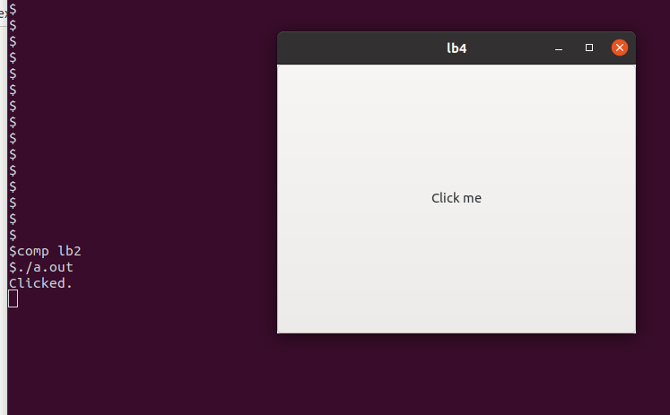

# Widgets (1)

## GtkLabel, GtkButton and Gtkbox

### GtkLabel

We made a window and show it on the screen in the previous section.
Now we go on to the next topic, widgets in the window.
The simplest widget is GtkLabel.
It is a widget with a string in it.

@@@include
misc/lb1.c
@@@

Save this program to a file `lb1.c`.
Then compile and run it.

    $ comp lb1
    $ ./a.out

A window with a message "Hello." appears.

{width=6.3cm height=5.325cm}

There's only a little change between `pr4.c` and `lb1.c`.
A program `diff` is good to know the difference between two files.

@@@shell
cd misc; diff pr4.c lb1.c
@@@

This tells us:

- The definition of a variable `lab` is added.
- The title of the window is changed.
- A label is created and connected to the window as a child.

The function `gtk_window_set_child (GTK_WINDOW (win), lab)` makes the label `lab` a child widget of the window `win`.
Be careful.
A child widget is different from a child object.
Objects have parent-child relationships and widgets also have parent-child relationships.
But these two relationships are totally different.
Don't be confused.
In the program `lb1.c`, `lab` is a child widget of `win`.
Child widgets are always located in their parent widget on the screen.
See the window appeared on the screen.
The window includes the label.

The window `win` doesn't have any parents.
We call such a window top-level window.
One application can have two or more top-level windows.

### GtkButton

Next widget is GtkButton.
It has a label or icon on it.
In this subsection, we will make a button with a label.
When a button is clicked on, it emits a "clicked" signal.
The following program shows how to catch the signal and do something.

@@@include
misc/lb2.c
@@@

Look at the line 17 to 19.
First, it creates a GtkButton instance `btn` with a label "Click me".
Then, adds the button to the window `win` as a child.
Finally, connects a "clicked" signal of the button to a handler (function) `click_cb`.
So, if `btn` is clicked, the function `click_cb` is invoked.
The suffix "cb" means "call back".

Name the program `lb2.c` and save it. 
Now compile and run it.

{width=11.205cm height=6.945cm}
 
A window with the button appears.
Click the button (it is a large button, you can click everywhere in the window), then a string "Clicked." appears on the terminal.
It shows the handler was invoked by clicking the button.

It's fairly good for us to make sure that the clicked signal was caught and the handler was invoked.
However, using g_print is out of harmony with Gtk which is a GUI library.
So, we will change the handler.
The following code is `lb3.c`.

@@@include
misc/lb3.c click_cb app_activate
@@@

And the difference between `lb2.c` and `lb3.c` is as follows.

@@@shell
cd misc; diff lb2.c lb3.c
@@@

The change is:

- The function `g_print` in `lb2.c` was deleted and two lines above are inserted instead.
- The label of `btn` is changed from "Click me" to "Quit".
- The fourth argument of `g_signal_connect` is changed from `NULL` to `win`. 

Most important is the fourth argument of `g_signal_connect`.
It is described as "data to pass to handler" in the definition of `g_signal_connect` in [GObject reference manual](https://developer.gnome.org/gobject/stable/gobject-Signals.html#g-signal-connect).
Therefore, `win` which is a pointer to GtkApplicationWindow is passed to the handler as a second parameter `user_data`.
Then, the handler cast it to a pointer to GtkWindow and call `gtk_window_destroy` to destroy the top-level window.
Then, the application quits.

### GtkBox

GtkWindow and GtkApplicationWindow can have only one child.
If you want to add two or more widgets in a window, you need a container widget.
GtkBox is one of the containers.
It arranges two or more child widgets into a single row or column.
The following procedure shows the way to add two buttons in a window.

- Create a GtkApplicationWindow instance.
- Create a GtkBox instance and add it to the GtkApplicationWindow as a child.
- Create a GtkButton instance and append it to the GtkBox.
- Create another GtkButton instance and append it to the GtkBox.

After this, the Widgets are connected as the following diagram.

{width=7.725cm height=2.055cm}

The program `lb4.c` includes these widgets.
It is as follows.

@@@include
misc/lb4.c
@@@

Look at the function `app_activate`.

After the creation of a GtkApplicationWindow instance, a GtkBox instance is created.

    box = gtk_box_new(GTK_ORIENTATION_VERTICAL, 5);
    gtk_box_set_homogeneous (GTK_BOX (box), TRUE);

The first argument arranges the children of the box vertically.
The second argument is the size between the children.
The next function fills the box with the children, giving them the same space.

After that, two buttons `btn1` and `btn2` are created and the signal handlers are set.
Then, these two buttons are appended to the box.

{width=6.3cm height=5.325cm}

The handler corresponds to `btn1` toggles its label.
The handler corresponds to `btn2` destroys the top-level window and the application quits.

